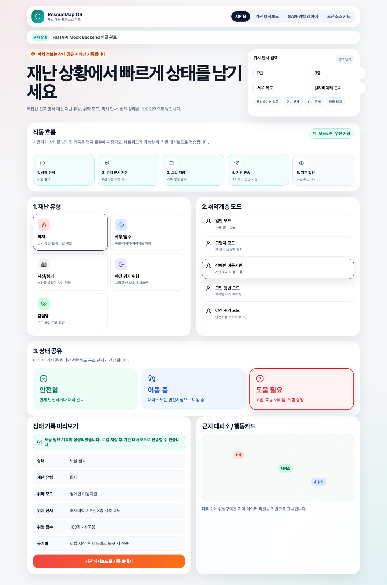

# RescueMap OS

> 재난 상황에서 시민과 취약계층의 위치 단서, 상태, 도움 요청을 기록하고 기관이 확인할 수 있도록 돕는 오픈소스 재난 대응 키트입니다.

## 1. 프로젝트 개요

RescueMap OS는 재난·고립·귀가 위험 상황에서 사용자가 최소 입력으로 자신의 상태와 위치 단서를 남기고, 보호자·학교·복지기관·지자체 담당자가 이를 확인할 수 있도록 돕는 오픈소스 재난 대응 플랫폼입니다.

이 프로젝트는 AI가 사용자의 생명을 대신 판단하거나 실내 탈출 경로를 지시하지 않습니다. 대신 다음 구조에 집중합니다.

- 재난 전: 대피 기억을 만든다
- 재난 중: 위치와 상태 단서를 남긴다
- 재난 후: 실패 지도를 만들어 다음 대응을 개선한다

## 2. 주요 기능

### 시민용 화면

- 재난 유형 선택
- 취약계층 모드 선택
- 위치 단서 입력
- 안전함 / 이동 중 / 도움 필요 3버튼 상태 공유
- 오프라인 우선 저장 흐름 표시
- 근처 대피소 및 행동카드 확인

### 기관 관리자 대시보드

- 도움 요청 목록 확인
- 위험 점수 참고
- 보호자 및 기관 체크인 상태 확인
- 기관 확인 완료 처리
- 실패지도 후보 등록

### SAR·공공데이터 위험 레이어

- 대피소 레이어
- 위험구역 레이어
- 사용자 위치 단서 레이어
- SAR 침수 참고 Mock 레이어
- 응급기관 및 복지시설 레이어 확장 구조

SAR 레이어는 실시간 구조 명령이나 사람 추적용이 아니라, 침수 가능 영역을 이해하기 위한 참고 레이어입니다.

### 오픈소스 재난 대응 키트

```text
rescue-kit/
├── disaster_protocols/
├── vulnerable_modes/
├── local_data/
└── report_templates/
disaster_protocols: 재난 유형별 행동 프로토콜 YAML
vulnerable_modes: 취약계층 지원 모드 YAML
local_data: 대피소 CSV, 위험구역 GeoJSON
report_templates: 재난 후 실패지도 리포트 Markdown
3. 현재 구현 상태

현재 MVP는 다음 기능을 포함합니다.

React 기반 시민용 상태 공유 화면
기관 관리자 대시보드 화면
SAR·공공데이터 위험 레이어 화면
오픈소스 키트 구조 설명 화면
FastAPI 기반 Mock Backend API
프론트엔드와 Mock API 연동 구조
4. 기술 스택
영역	기술
Frontend	React, Vite, TypeScript
UI	CSS, lucide-react
Backend	FastAPI
API Docs	Swagger UI
Data	YAML, CSV, GeoJSON, JSON
Version Control	Git, GitHub
5. 실행 방법
Frontend
cd frontend
npm install
npm run dev

Frontend URL:

http://localhost:5173
Backend
cd backend
python3 -m venv .venv
source .venv/bin/activate
pip install -r requirements.txt
uvicorn main:app --reload --port 8000

Backend URL:

http://127.0.0.1:8000

Swagger API Docs:

http://127.0.0.1:8000/docs
6. 주요 API
GET    /api/incidents
POST   /api/status
PATCH  /api/incidents/{incident_id}/checkin
GET    /api/layers
GET    /api/kit
GET    /api/failure-report
7. 작동 흐름
시민 상태 공유
→ 위치 단서 로컬 저장
→ 네트워크 가능 시 기관 대시보드 전송
→ 기관 담당자 확인
→ 체크인 상태 변경
→ 재난 후 실패지도 후보 등록
8. 하지 않는 것

RescueMap OS는 다음 기능을 제공하지 않습니다.

AI 기반 생명 판단
AI 기반 실내 탈출 경로 안내
의료 진단
구조 성공 보장
위치 상시 추적
9. 라이선스

MIT License

10. 제작자

Lee Youngjun
Paejae University, Department of Computer Science
GitHub: @gxmzung

---

## 11. 구현 화면

### 시민용 상태 공유 화면

사용자는 재난 유형, 취약계층 모드, 위치 단서를 선택한 뒤 안전함 / 이동 중 / 도움 필요 중 하나를 눌러 상태 기록을 생성할 수 있습니다.



### 기관 관리자 대시보드

기관 담당자는 도움 요청 목록, 위험 점수, 위치 단서, 체크인 상태를 확인하고 기관 확인 완료 또는 실패지도 후보 등록 처리를 할 수 있습니다.


### SAR·공공데이터 위험 레이어

SAR 침수 참고 레이어, 위험구역, 대피소, 사용자 위치 단서를 함께 표시하여 우선 확인 대상을 판단할 수 있도록 돕습니다.


### 오픈소스 재난 대응 키트

지역·학교·기관이 재난 프로토콜, 취약계층 모드, 대피소 데이터, 위험구역 데이터를 직접 수정할 수 있는 구조를 제공합니다.


---

## 12. SQLite Persistence

The backend now stores incident records in a local SQLite database.

백엔드는 이제 시민 상태 기록과 기관 체크인 상태를 로컬 SQLite 데이터베이스에 저장합니다.

### Stored Data

- incident id
- status
- disaster type
- vulnerable mode
- location clue
- risk score
- check-in status
- created time label

The local database file is created at:

```text
backend/data/rescuemap.db
This database file is excluded from Git by .gitignore.

SQLite는 MVP 단계의 로컬 저장 구조이며, 향후 PostgreSQL/PostGIS 기반 공간 데이터베이스로 확장할 수 있습니다.

---

## 13. Failure Map Report Generation

RescueMap OS can generate a post-disaster failure-map report from incident records.

RescueMap OS는 시민 상태 기록과 기관 체크인 상태를 기반으로 재난 후 실패지도 리포트를 생성할 수 있습니다.

### Report Generation API

```text
POST /api/failure-report/generate
GET  /api/failure-report/markdown
Report Contents
total incident records
failure-map candidate count
high-risk candidate count
repeated failure locations
disaster type summary
vulnerable mode summary
candidate record table

Generated reports are saved locally under:

backend/reports/

Generated report files are excluded from Git by .gitignore.

이 기능은 재난 대응 종료 후 반복 고립 구역, 체크인 지연, 취약계층 지원 공백을 파악하기 위한 개선 리포트입니다.

---

## 14. Local Data Driven Map Layers

RescueMap OS now reads map-layer data from the editable open-source kit.

RescueMap OS는 지도 레이어 데이터를 코드에 고정하지 않고, 수정 가능한 오픈소스 키트 데이터에서 읽습니다.

### Data Sources

```text
rescue-kit/local_data/shelters.csv
rescue-kit/local_data/danger_zones.geojson
Related API
GET /api/local-data/shelters
GET /api/local-data/danger-zones
Current Map Layers
Shelter markers from CSV
Danger-zone polygons from GeoJSON
User location clue marker
SAR flood reference mock polygon
Emergency and welfare facility extension markers

This structure allows local governments, schools, welfare centers, and communities to adapt the map layers without changing frontend code.

이 구조를 통해 지자체, 학교, 복지기관, 지역 커뮤니티가 프론트엔드 코드를 수정하지 않고도 대피소와 위험구역 데이터를 바꿀 수 있습니다.

---

## 15. Nationwide Local Data Structure

RescueMap OS is not designed as a single-campus-only system.

RescueMap OS는 특정 학교나 특정 지역 전용 시스템이 아니라, 전국 지자체·학교·복지기관이 각자의 지역 데이터를 수정해 사용할 수 있는 구조를 목표로 합니다.

### Current Sample Regions

- 대전
- 서울
- 부산
- 광주
- 대구
- 인천
- 제주

### Region-based Data

The local data files include a `region` field.

```text
rescue-kit/local_data/shelters.csv
rescue-kit/local_data/danger_zones.geojson
This allows each local government, school, welfare center, or community to maintain its own shelter and danger-zone data.

각 기관은 프론트엔드 코드를 수정하지 않고 CSV와 GeoJSON 데이터만 수정하여 자기 지역의 대피소와 위험구역을 반영할 수 있습니다.

---

## 16. Nationwide Disaster Scenario Runner

RescueMap OS includes a nationwide disaster scenario runner for demonstration and testing.

RescueMap OS는 전국 단위 재난 대응 흐름을 시연하고 테스트하기 위한 시나리오 실행 기능을 포함합니다.

### Current Scenario Samples

- Seoul urban flood scenario
- Busan typhoon and coastal-risk scenario
- Daejeon building fire isolation scenario
- Jeju typhoon and vulnerable-user check-in scenario

### Scenario Flow

```text
Select scenario
→ Create citizen status record
→ Send to FastAPI backend
→ Show on institution dashboard
→ Update check-in status
→ Register as failure-map candidate
→ Generate post-disaster report
This feature helps judges and contributors understand how RescueMap OS works as a nationwide, data-driven open-source disaster response kit.

이 기능은 RescueMap OS가 특정 지역 전용 앱이 아니라 전국 지역 데이터와 재난 시나리오를 기반으로 확장 가능한 오픈소스 재난 대응 키트임을 보여줍니다.
